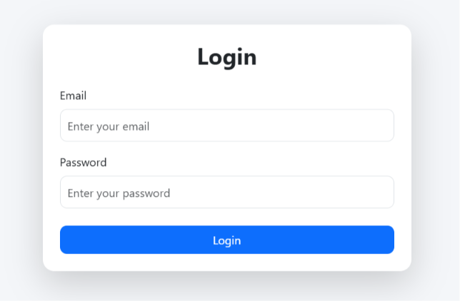
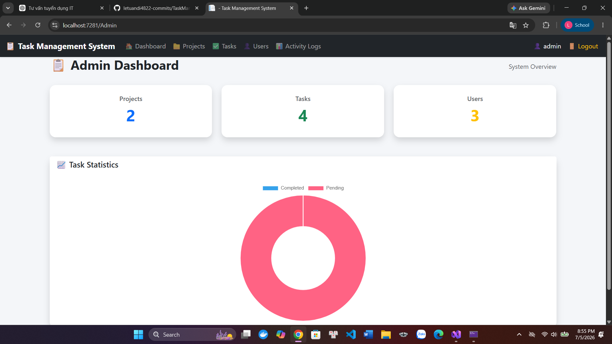
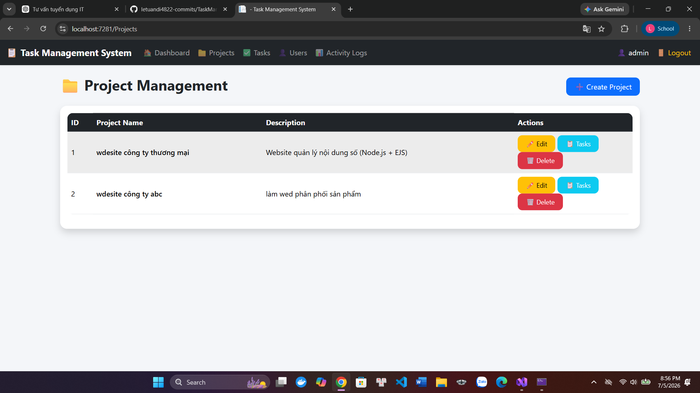
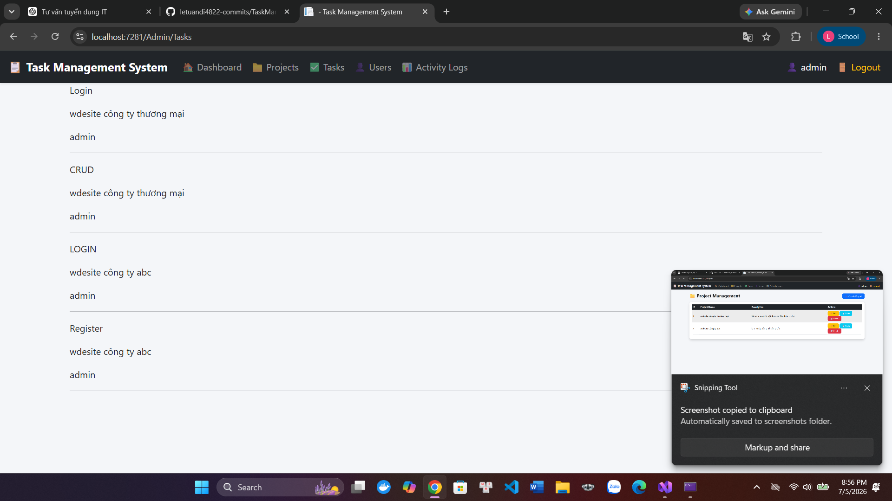
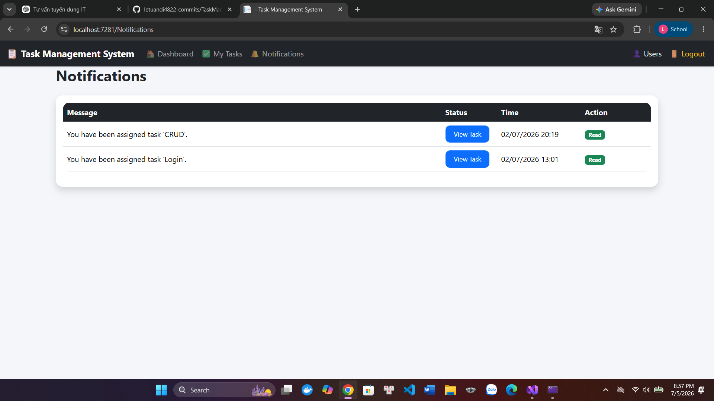
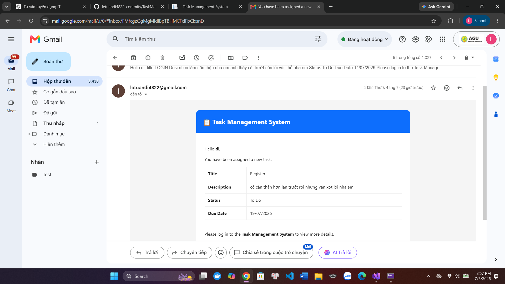
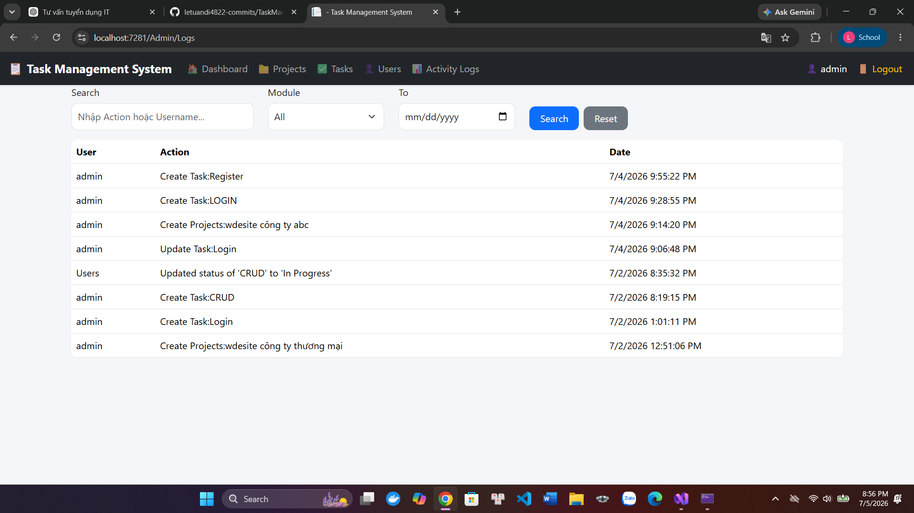

# Task Management System

A web-based Task Management System built with **ASP.NET Core MVC** that helps administrators manage projects, assign tasks, track progress, upload attachments, and notify users via email.

---

## Features

- 🔐 User Authentication (Login/Register)
- 👥 Role-based Authorization (Admin/User)
- 📁 Project Management
- ✅ Task Assignment
- 📊 Dashboard with Chart.js statistics
- 🔔 Notification Center
- 📧 Email Notification (MailKit + Gmail SMTP)
- 📎 Task File Upload
- 📝 Activity Logs
- 📅 Task Due Date Management

---

## Technologies

- ASP.NET Core MVC (.NET 8)
- Entity Framework Core
- SQL Server LocalDB
- Bootstrap 5
- Chart.js
- MailKit
- BCrypt.Net

---

## Demo Accounts

| Role | Email | Password |
|------|-------|----------|
| Admin | admin@example.com | 123456 |
| User | john@example.com | 123456 |

> These accounts are automatically created by the Database Seeder.

---

## Screenshots

### Login



### Admin Dashboard



### Projects



### Tasks



### Notifications



### Email Notification



### Activity Logs



---

# Getting Started

## Prerequisites

- Visual Studio 2022
- .NET 8 SDK
- SQL Server LocalDB

---

## Installation

### 1. Clone the repository

```bash
git clone https://github.com/letuandi4822-commits/TaskManagementSystem.git
```

### 2. Open the project

Open

```
TaskManagementSystem.csproj
```

using **Visual Studio 2022**.

### 3. Restore NuGet packages

Visual Studio will restore packages automatically.

### 4. Create the database

Open **Package Manager Console**

Run

```powershell
Update-Database
```

The database will be created automatically.

### 5. Seed demo data

The application automatically creates:

- 1 Admin account
- 1 User account
- Sample Projects
- Sample Tasks
- Sample Notifications
- Sample Activity Logs

on the first run.

### 6. Configure Email (Optional)

Edit

```
appsettings.json
```

```json
"EmailSettings": {
  "Email": "your-email@gmail.com",
  "Password": "your-app-password",
  "Host": "smtp.gmail.com",
  "Port": 587
}
```

If you leave these values empty, the application still works normally except email notifications.

### 7. Run the project

Press

```
F5
```

or click

```
Start
```

in Visual Studio 2022.

---

## Project Structure

```
Controllers/
Data/
EmailTemplates/
Migrations/
Models/
Services/
ViewModel/
Views/
wwwroot/
```

---

## Future Improvements

- Search and Filter
- Pagination
- Task Comments
- Profile Management
- Dark Mode
- Docker Support
- Unit Testing

---

## Author

**Le Tuan Di**

GitHub

https://github.com/letuandi4822-commits

---
